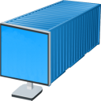

# desktainer



[](https://github.com/dmotte/desktainer/actions)
[](https://hub.docker.com/r/dmotte/desktainer)

:computer: Remote **desk**top in a con**tainer**.

> :package: This image is also on **Docker Hub** as [`dmotte/desktainer`](https://hub.docker.com/r/dmotte/desktainer) and runs on **several architectures** (e.g. amd64, arm64, ...). To see the full list of supported platforms, please refer to the [`.github/workflows/release.yml`](.github/workflows/release.yml) file. If you need an architecture which is currently unsupported, feel free to open an issue.

Thanks to [fcwu/docker-ubuntu-vnc-desktop](https://github.com/fcwu/docker-ubuntu-vnc-desktop) and [soffchen/tiny-remote-desktop](https://github.com/soffchen/tiny-remote-desktop) for the inspiration.

## Simple usage

The simplest way to try this image is:

```bash
docker run -it --rm -p 6901:6901 dmotte/desktainer
```

Then head over to http://localhost:6901/ to access the remote desktop.


## Standard usage

The [`docker-compose.yml`](docker-compose.yml) file contains a complete usage example for this image. Feel free to simplify it and adapt it to your needs. Unless you want to build the image from scratch, comment out the `build: build` line to use the pre-built one from _Docker Hub_ instead.

To start the Docker-Compose stack in daemon (detached) mode:

```bash
docker-compose up -d
```

Then you can view the logs using this command:

```bash
docker-compose logs -ft
```

## Tips

- :bulb: If you want to **change the resolution** while the container is running, you can use the `xrandr --fb 1024x768` command. The new resolution cannot be larger than the one specified in the `RESOLUTION` environment variable though
- :bulb: If you need to, you can extend this project by making your own `Dockerfile` starting from this image (i.e. `FROM dmotte/desktainer`) and/or mount custom _supervisor_ configuration files. See the [`example`](example) folder for an example of how to do it
- :bulb: This image is not meant to be run with the `--user` Docker option, because the [`startup.sh`](build/startup.sh) script needs to run as root in the initial phase. Moreover, the custom user created via the `USER` environment variable (see below) will be a **sudoer**, so running the container as root is useful in any case. If you want a **rootless** version of this image, check out [dmotte/desktainer-rootless](https://github.com/dmotte/desktainer-rootless)

## Running commands at container startup

If you need to run commands at container startup, you can create Bash scripts in the following locations:

- `/opt/startup-early/*.sh`: these scripts will be included in alphabetical order **before** the main container initialization process
- `/opt/startup-late/*.sh`: these scripts will be included in alphabetical order **after** the main container initialization process

See the [`startup.sh`](build/startup.sh) script for more details.

Moreover, if you need to run commands after the LXDE startup, you can create launcher files in the `/etc/xdg/autostart` or the `~/.config/autostart` directory.

## Environment variables

List of supported **environment variables**:

| Variable       | Required                 | Description                                                                                              |
| -------------- | ------------------------ | -------------------------------------------------------------------------------------------------------- |
| `RESOLUTION`   | No (default: 1920x1080)  | Screen resolution                                                                                        |
| `USER`         | No (default: mainuser)   | Name of the custom user. If set to `root`, no custom user will be created and the main user will be root |
| `PASSWORD`     | No (default: `mainuser`) | Password of the custom user (if `USER != root`)                                                          |
| `VNC_PASSWORD` | No (default: none)       | Password for the VNC server                                                                              |
| `VNC_PORT`     | No (default: 5901)       | TCP port of the VNC server                                                                               |
| `NOVNC_PORT`   | No (default: 6901)       | TCP port of the noVNC webserver                                                                          |

## Development

If you want to contribute to this project, you can use the following one-liner to **rebuild the image** and bring up the **Docker-Compose stack** every time you make a change to the code:

```bash
docker-compose down && docker-compose up --build
```
